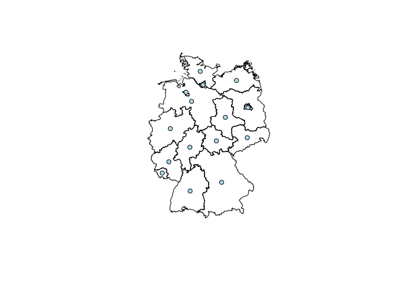

<!-- README.md is generated from README.Rmd. Please edit that file -->
<!-- C:\OSGeo4W64\bin\python-qgis -> opens Python!! -->
RQGIS
=====

RQGIS establishes an interface between R and QGIS, i.e. it allows the user to access QGIS functionalities from within R. It achieves this by using the QGIS API via the command line. This provides the user with an extensive suite of GIS functions, since QGIS allows you to call native as well as third-party algorithms via its processing framwork (see also <https://docs.qgis.org/2.6/en/docs/user_manual/processing/index.html>). Third-party providers include GDAL, GRASS GIS, SAGA GIS, the Orfeo Toolbox, TauDEM and tools for LiDAR data. RQGIS brings you this incredibly powerful geoprocessing environment to the R console. The main advantages of RQGIS are:

1.  It provides access to QGIS functionalities. Thereby, it calls Python from the command line (QGIS API) but R users can stay in their programming environment of choice without having to touch Python.
2.  It offers a broad suite of geoalgorithms making it possible to solve virtually any GIS problem.
3.  R users can just use one package (RQGIS) instead of using RSAGA and spgrass to access SAGA and GRASS functions. This, however, does not mean that RSAGA and spgrass are obsolete since both packages offer various other advantages. For instance, RSAGA provides many user-friendly and ready-to-use GIS functions such as `rsaga.slope.asp.curv` and `multi.focal.function`. Besides, both RSAGA and spgrass let you specify specific GIS function arguments while retrieving automatically the default values for unspecified GIS function arguments. So far, this is not possible using RQGIS, i.e. you need to specify each single function argument. This can be tedious and we hope that we will take care of this in future releases.

Installation
============

Before installing RQGIS, download the latest OSGeo4W from <http://trac.osgeo.org/osgeo4w/>, and make sure that following components will be installed on your system using the advanced settings during the installation process:

-   gdal
-   grass
-   msys
-   Python27
-   qgis
-   Qt4
-   saga

After the installation of OSGeo4W these programs should be found in `../OSGeo4W64/apps`. Soon, we will also provide you with a detailed OSGeo4W installation manual.

You can install the latest RQGIS development version from Github with

``` r
if (packageVersion("devtools") < 1.6) {
    install.packages("devtools")    
    }
if (!"lazyeval" %in% installed.packages()[, "Package"]) {
devtools::install_github("hadley/lazyeval")  
}
devtools::install_github("jannes-m/RQGIS")
```

**Please note that RQGIS is still a beta version and under active development.** Therefore, it is likely that major changes will occur in the near future. If you detect any bugs, let us know or, even better, commit a pull request.

Usage
=====

Subsequently, we will show you a typical workflow of how to use RQGIS. Let's start with a very simple example and assume that we simply wanted to retrieve the centroid coordinates of a spatial polygon object. Using the raster package, we download administrative areas of Germany. Secondly, we save the resulting SpatialObject as a shapefile in a temporary folder.

``` r
# attach packages
library("raster")
library("rgdal")

# define path to a temporary folder
dir_tmp <- tempdir()
# download German administrative areas
ger <- getData(name = "GADM", country = "DEU", level = 1)
# save ger as a shapefile in our temporary folder
writeOGR(ger, dir_tmp, "ger", driver = "ESRI Shapefile", overwrite_layer = TRUE)
```

Now that we have a shapefile, we can move on to using RQGIS. First of all, we need to specify all the paths necessary to run the QGIS-API. Fortunately, `set_env` does this for us. The only thing we need to do is: specify the path to the OSGeo4W-installation. If you do not specify a path, `set_env` tries to find the OSGeo4W-installation on your C: drive. So far `set_env` only works on Windows-systems, but we are working hard to make it availabe for UNIX-systems as well. Please note, that most of the RQGIS functions, you are likely to work with (such as `get_usage`, `get_options` and `run_qgis`), require the output list containing the paths to the various installations necessary to run QGIS from within R.

``` r
# attach RQGIS
library("RQGIS")

# set the environment, i.e. specify all the paths necessary to run QGIS from 
# within R
my_env <- set_env(path = "C:/OSGeo4W64")
# have a look at the paths necessary to run QGIS from within R
my_env
#> $root
#> [1] "C:\\OSGeo4W64"
#> 
#> $qgis
#> [1] "C:\\OSGeo4W64\\apps\\qgis"
#> 
#> $Python27
#> [1] "C:\\OSGeo4W64\\apps\\Python27"
#> 
#> $Qt4
#> [1] "C:\\OSGeo4W64\\apps\\Qt4"
#> 
#> $gdal
#> [1] "C:\\OSGeo4W64\\apps\\gdal"
#> 
#> $msys
#> [1] "C:\\OSGeo4W64\\apps\\msys"
#> 
#> $grass
#> [1] "C:\\OSGeo4W64\\apps\\grass"
#> 
#> $saga
#> [1] "C:\\OSGeo4W64\\apps\\saga"
```

Secondly, we would like to find out how the function in QGIS is called which gives us the centroids of a polygon shapefile. To do so, we use `find_algorithms`. We suspect that the function we are looking for contains the words *polygon* and *centroid*.

``` r
# look for a function that contains the words "polygon" and "centroid"
find_algorithms(search_term = "polygon centroid", 
                qgis_env = my_env)
#> [1] "Polygon centroids------------------------------------>qgis:polygoncentroids"
#> [2] "Polygon centroids------------------------------------>saga:polygoncentroids"
#> [3] ""
```

This gives us two functions we could use. Here, we'll choose the QGIS function named `qgis:polygoncentroids`. Subsequently, we would like to know how we can use it, i.e. which function parameters we need to specify.

``` r
get_usage(algorithm_name = "qgis:polygoncentroids",
          qgis_env = my_env,
          intern = TRUE)
#> [1] "ALGORITHM: Polygon centroids"   "\tINPUT_LAYER <ParameterVector>"
#> [3] "\tOUTPUT_LAYER <OutputVector>"   ""                              
#> [5] ""                               ""
```

All the function expects, is a parameter called INPUT\_LAYER, i.e. the path to a polygon shapefile whose centroid coordinates we wish to extract, and a parameter called OUTPUT\_Layer, i.e. the path to the output shapefile. `run_qgis` expects exactly these function parameters as a list.

``` r
# construct a list with our function parameters
params <- list(
  # path to the input shapefile
  INPUT_LAYER = paste(dir_tmp, "ger.shp", sep = "\\"),
  # path to the output shapefile
  OUTPUT_LAYER = paste(dir_tmp, "ger_coords.shp", sep = "\\"))
run_qgis(algorithm = "qgis:polygoncentroids", 
         qgis_env = my_env,
         params = params)
```

Excellent! No error message occured, that means QGIS created a points shapefile containing the centroids of our polygons shapefile. Naturally, we would like to check if the result meets our expectations. Therefore, we load the result into R and visualize it.

``` r
# load the point shapefile QGIS has created for us
ger_coords <- readOGR(dsn = dir_tmp, layer = "ger_coords", verbose = FALSE)
# first, plot the federal states of Germany
plot(ger)
# next plot the centroids created by QGIS
plot(ger_coords, pch = 21, add = TRUE, bg = "lightblue", col = "black")
```



Of course, this is a very simple example. We could have achieved the same using `sp::coordinates`. To harness the real power of integrating R with a GIS, we will present a second, more complex example. Yet to come in the form of a vignette...

TO DO:
======

-   OSGeo4w installation guide/manual with screenshots
-   processing.runalg -&gt; user has to provide each argument and cannot call single arguments, find out if there is a more user-friendly way
-   Check if run\_qgis in fact is able to run all QGIS, SAGA, GRASS, GDAL functions (Sextante). It could be a problem that one needs to specify function arguments as characters.
-   Take care of the error message: ERROR 1: Can't load requested DLL: C:4~1\_FileGDB.dll 193: %1 ist keine zulässige Win32-Anwendung.
-   Write find\_root for Linux and Apple
-   Write html-vignette, i.e. present a more complex QGIS example
-   find out if SAGA and GRASS can be located somewhere else on the system, i.e. if they can be located outside of C:/OSGeo4W64. I think they might but that would make it quite hard to set the environment under Windows since the OSGeo4W-installation already comes with various batch scripts to set up the environment. Not using the OSGeo4W-installation would mean to set up the environment manually. I don't think that this is a good idea, especially if you aim to do so in a generic way.
-   find out how to set the paths under UNIX systems
-   extent set\_env() so that it can be run under UNIX systems
-   unresolved error message when running "processing.runalg" on Mac: "QSqlDatabase: QSQLITE driver not loaded
QSqlDatabase: available drivers: 
QSqlQuery::prepare: database not open
  [1] "ERROR: Opening of authentication db FAILED"
  [2] "WARNING: Auth db query exec() FAILED". Processes executing as expected though. 