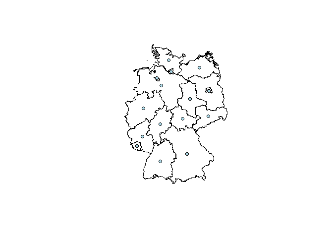

<!-- README.md is generated from README.Rmd. Please edit that file -->
<!-- C:\OSGeo4W64\bin\python-qgis -> opens Python!! -->
RQGIS
=====

RQGIS establishes an interface between R and QGIS, i.e. it allows the user to access QGIS functionalities from within R. It achieves this by using the QGIS API via the command line. This provides the user with an extensive suite of GIS functions, since QGIS allows you to call native as well as third-party algorithms via its processing framwork (see also <https://docs.qgis.org/2.6/en/docs/user_manual/processing/index.html>). Third-party providers include among others GDAL, GRASS GIS, SAGA GIS, the Orfeo Toolbox, TauDEM and tools for LiDAR data. RQGIS brings you this incredibly powerful geoprocessing environment to the R console. The main advantages of RQGIS are:

1.  It provides access to QGIS functionalities. Thereby, it calls Python from the command line (QGIS API) but R users can stay in their programming environment of choice without having to touch Python.
2.  It offers a broad suite of geoalgorithms making it possible to solve virtually any GIS problem.
3.  R users can just use one package (RQGIS) instead of using RSAGA and spgrass to access SAGA and GRASS functions. This, however, does not mean that RSAGA and spgrass are obsolete since both packages offer various other advantages. For instance, RSAGA provides many user-friendly and ready-to-use GIS functions such as `rsaga.slope.asp.curv` and `multi.focal.function`.

Installation
============

You can install the latest RQGIS development version from Github with

``` r
if (packageVersion("devtools") < 1.6) {
    install.packages("devtools")    
    }
if (!"lazyeval" %in% installed.packages()[, "Package"]) {
devtools::install_github("hadley/lazyeval")  
}
devtools::install_github("jannes-m/RQGIS")
```

**Please note that RQGIS is still a beta version and under active development.** Therefore, it is likely that major changes will occur in the near future. If you detect any bugs, let us know or, even better, commit a pull request.

In order to run RQGIS properly, you need to download various third-party software packages. To fascilitate the download and installation procedures, we provide you with a platform-dependent installation manual in the following subsections.

Windows
-------

Before installing RQGIS, download the latest OSGeo4W from <http://trac.osgeo.org/osgeo4w/>, and make sure that following components will be installed on your system using the advanced settings during the installation process:

-   Python27
-   qgis
-   Qt4
-   gdal (optional)
-   grass (optional)
-   msys (necessary, if you want to run GRASS)
-   saga (optional)

After the installation of OSGeo4W these programs should be found in `../OSGEO4~1/apps`. Soon, we will also provide you with a detailed installation manual.

Linux
-----

For Debian/Ubuntu, please follow the installation instructions found under this link [https://www.qgis.org/de/site/forusers/alldownloads.html](here). Note that if you install QGIS from the built-in Software managers of your OS, you will most likely get a rather old QGIS version as these repositories only getting updated quite sparsely. For other Linux builds, please see respective tutorial for yourself. If you want to harness the real power of RQGIS, you might want to install also GDAL, GRASS, SAGA and other applications (TauDEM, )

### How to install SAGA on Ubuntu?

To use SAGA functions within (R)QGIS, you naturally need to install SAGA GIS. To install the most recent SAGA version, simply execute the following lines in a terminal window:

``` bash
sudo add-apt-repository ppa:johanvdw/saga-gis  
sudo apt-get update
sudo apt-get install saga
```

MAC
---

For Mac, please follow this link [https://www.qgis.org/de/site/forusers/download.html](link) to install QGIS. We recommend to download the latest stable release.

RQGIS usage
===========

Subsequently, we will show you a typical workflow of how to use RQGIS. Basically, we will follow the steps also described in the [QGIS documentation](https://docs.qgis.org/2.8/en/docs/user_manual/processing/console.html). In our first and very simple example we simply would like to retrieve the centroid coordinates of a spatial polygon object. First off, we will download the administrative areas of Germany using the raster package. Secondly, we save the resulting SpatialObject as a shapefile in a temporary folder.

``` r
# attach packages
library("raster")
library("rgdal")

# define path to a temporary folder
dir_tmp <- tempdir()
# download German administrative areas
ger <- getData(name = "GADM", country = "DEU", level = 1)
# save ger as a shapefile in our temporary folder
writeOGR(ger, dir_tmp, "ger", driver = "ESRI Shapefile", overwrite_layer = TRUE)
```

Now that we have a shapefile, we can move on to using RQGIS. First of all, we need to specify all the paths necessary to run the QGIS-API. Fortunately, `set_env` does this for us (assuming that QGIS and all necessary dependencies were installed correctly). The only thing we need to do is: specify the root path to the QGIS-installation. If you do not specify a path, `set_env` tries to find the OSGeo4W-installation on your C: drive (Windows). If you are running RQGIS under Linux or on a Mac, `set_env` assumes that your root path is "/usr" and "/applications/QGIS.app/Contents", respectively. Please note, that most of the RQGIS functions, you are likely to work with (such as `find_algorithms`, `get_args_man` and `run_qgis`), require the output list (as returned by `set_env`) containing the paths to the various installations necessary to run QGIS from within R.

``` r
# attach RQGIS
library("RQGIS")

# set the environment, i.e. specify all the paths necessary to run QGIS from 
# within R
my_env <- set_env()
#> Trying to find OSGeo4W on your C: drive.
# have a look at the paths necessary to run QGIS from within R
my_env
#> $root
#> [1] "C:\\OSGeo4W64"
#> 
#> $qgis_prefix_path
#> [1] "C:\\OSGeo4W64\\apps\\qgis"
#> 
#> $python_plugins
#> [1] "C:\\OSGeo4W64\\apps\\qgis\\python\\plugins"
#> 
#> $python27
#> [1] "C:\\OSGeo4W64\\apps\\Python27"
#> 
#> $qt4
#> [1] "C:\\OSGeo4W64\\apps\\Qt4"
#> 
#> $msys
#> [1] "C:\\OSGeo4W64\\apps\\msys"
#> 
#> $grass
#> [1] "C:\\OSGeo4W64\\apps\\grass"
```

Secondly, we would like to find out how the function in QGIS is called which gives us the centroids of a polygon shapefile. To do so, we use `find_algorithms`. We suspect that the function we are looking for contains the words *polygon* and *centroid*.

``` r
# look for a function that contains the words "polygon" and "centroid"
find_algorithms(search_term = "polygon centroid", 
                qgis_env = my_env)
#> [1] "Polygon centroids------------------------------------>qgis:polygoncentroids"
#> [2] "Polygon centroids------------------------------------>saga:polygoncentroids"
#> [3] ""
```

This gives us two functions we could use. Here, we'll choose the QGIS function named `qgis:polygoncentroids`. Subsequently, we would like to know how we can use it, i.e. which function parameters we need to specify.

``` r
get_usage(algorithm_name = "qgis:polygoncentroids",
          qgis_env = my_env,
          intern = TRUE)
#> [1] "ALGORITHM: Polygon centroids"   "\tINPUT_LAYER <ParameterVector>"
#> [3] "\tOUTPUT_LAYER <OutputVector>"   ""                              
#> [5] ""                               ""
```

Consequently `qgis:polygoncentroids` only expects a parameter called `INPUT_LAYER`, i.e. the path to a polygon shapefile whose centroid coordinates we wish to extract, and a parameter called `OUTPUT_LAYER`, i.e. the path to the output shapefile. Since it would be tedious to specify manually each and every function argument, especially if a function has more than two or three arguments, we have written a convenience function named `get_args_man`. This function basically mimicks the behaviour of the QGIS GUI, i.e. it retrieves all function arguments and respective default values for a given GIS function. It returns these values in the form of a list, i.e. exactly in the format as expected by `run_qgis` (see further below). If you additionally set the argument `options` to `TRUE`, the function automatically uses the first option if a function argument has several options. For example, `qgis:addfieldtoattributestable` has three options for the `FIELD\_TYPE`-parameter, namely integer, float and string. Setting `options` to `TRUE` means that the field type of your new column will be of type integer.

``` r
params <- get_args_man(alg = "qgis:polygoncentroids", 
                       qgis_env = my_env)
params
#> $INPUT_LAYER
#> [1] "None"
#> 
#> $OUTPUT_LAYER
#> [1] "None"
```

In our case, `qgis:polygoncentroids` has only two function arguments and no default values. Naturally, we need to specify our input and output layer manually. Tab-completion, as for instance provided by the wonderful RStudio IDE, greatly fascilitates this task.

``` r
# path to the input shapefile
params$INPUT_LAYER  <- paste(dir_tmp, "ger.shp", sep = "\\")
# path to the output shapefile
params$OUTPUT_LAYER <- paste(dir_tmp, "ger_coords.shp", sep = "\\")
run_qgis(algorithm = "qgis:polygoncentroids",
         params = params,
         qgis_env = my_env)
#> character(0)
```

Excellent! No error message occured, that means QGIS created a points shapefile containing the centroids of our polygons shapefile. Naturally, we would like to check if the result meets our expectations. Therefore, we load the result into R and visualize it.

``` r
# load the point shapefile QGIS has created for us
ger_coords <- readOGR(dsn = dir_tmp, layer = "ger_coords", verbose = FALSE)
# first, plot the federal states of Germany
plot(ger)
# next plot the centroids created by QGIS
plot(ger_coords, pch = 21, add = TRUE, bg = "lightblue", col = "black")
```



Of course, this is a very simple example. We could have achieved the same using `sp::coordinates`. To harness the real power of integrating R with a GIS, we will present a second, more complex example. Yet to come in the form of a vignette or a paper...

TO DO:
======

-   test the implemented functions, especially `run_qgis`, by running numerous QGIS, SAGA and GRASS functions. Is's more than likely that we still need to make `run_qgis` more generic. For instance, it could be a problem that all function arguments are submitted as characters.
-   platform-specific installation guide/manual (with screenshots) + how to install SAGA under Ubuntu 16.04 (I assume we need to install SAGA manually...)
-   build\_cmds: py\_cmd could be a one liner for all platforms
-   Take care of the error message: ERROR 1: Can't load requested DLL: C:4~1\_FileGDB.dll 193: %1 ist keine zulässige Win32-Anwendung.
-   Rewrite check\_apps and set\_env in such a way that the user might specify root, qgis\_prefix\_path, python\_plugins himself (at least for UNIX)
-   Write html-vignette, i.e. present a more complex QGIS example
